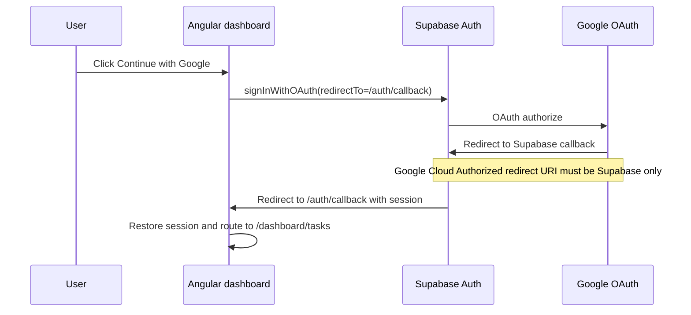

# Dashboard auth setup

This document covers Supabase auth for the SOMLIA dashboard: browser OAuth wiring, redirect URLs, and the server-side JWT boundary.

## OAuth flow (Google)



### Redirect URL responsibilities

| Setting | Value | Where |
| --- | --- | --- |
| Google Cloud **Authorized redirect URI** | `https://<project-ref>.supabase.co/auth/v1/callback` | Google Cloud Console OAuth client |
| Supabase **Redirect URLs** | `https://app.somlia.com/auth/callback`, `http://localhost:4200/auth/callback`, preview URLs | Supabase Dashboard → Authentication → URL Configuration |
| Angular OAuth `redirectTo` | Same as Supabase redirect URLs above | Generated from `DASHBOARD_AUTH_CALLBACK_URL` |

Do **not** put the Angular URL in Google Cloud. Google must redirect to Supabase first; Supabase then sends the user back to the dashboard callback route.

Production examples:

- Google redirect URI: `https://qufrbaxgiknacfsjfqoy.supabase.co/auth/v1/callback`
- Supabase redirect URL: `https://app.somlia.com/auth/callback`
- Post-login route: `https://app.somlia.com/dashboard/tasks`

## What lives where

| Layer | Package / surface | Purpose |
| --- | --- | --- |
| Browser dashboard | `@supabase/supabase-js` | Google OAuth, session restore, sign-out |
| Server / Edge Functions | `@supabase/server` | JWT verification and privileged server work |
| Landing waitlist | existing `loops-waitlist` function | Unchanged; not a dashboard lifecycle function |

Do **not** install `@supabase/server` in `apps/dashboard`. That package is server-only.

## Dashboard browser env generation

Angular reads public auth values from generated `src/environments/environment.generated.ts`.

Generate locally from `apps/dashboard/.env.local`:

```bash
cd apps/dashboard
npm run generate-env
```

Documented variable names (`apps/dashboard/.env.example`):

- `DASHBOARD_APP_URL`
- `DASHBOARD_SUPABASE_URL`
- `DASHBOARD_SUPABASE_PUBLISHABLE_KEY`
- `DASHBOARD_AUTH_REDIRECT_URL`
- `DASHBOARD_AUTH_CALLBACK_URL`
- `DASHBOARD_AUTH_ENABLED`
- `DASHBOARD_GOOGLE_ENABLED`

`npm run start` and `npm run build` run `generate-env` automatically.

### Vercel (`app.somlia.com`)

Set these in the dashboard Vercel project:

```txt
DASHBOARD_APP_URL=https://app.somlia.com
DASHBOARD_SUPABASE_URL=https://qufrbaxgiknacfsjfqoy.supabase.co
DASHBOARD_SUPABASE_PUBLISHABLE_KEY=<supabase publishable key>
DASHBOARD_AUTH_REDIRECT_URL=https://app.somlia.com/dashboard/tasks
DASHBOARD_AUTH_CALLBACK_URL=https://app.somlia.com/auth/callback
DASHBOARD_AUTH_ENABLED=true
DASHBOARD_GOOGLE_ENABLED=true
DASHBOARD_INVITE_GATE_ENABLED=true
```

Never put secret keys, service-role keys, or webhook secrets into Angular or dashboard public env vars.

## Edge Function: `dashboard-session`

Path: `supabase/functions/dashboard-session/index.ts`

Purpose:
- verify a caller's Supabase user JWT with `@supabase/server`
- return minimal identity metadata only
- establish the future backend boundary before private dashboard tables exist

Platform config:
- `supabase/config.toml` sets `verify_jwt = true` for `dashboard-session`
- `loops-waitlist` remains `verify_jwt = false` because it uses a custom webhook secret header

## Invite-only access gate (SOM-54 / SOM-65)

Dashboard beta access is invite-only. Waitlist rows in `public."Whitelist"` do **not** grant dashboard access.

### Database

Apply `supabase/dashboard_invites.sql` in the Supabase SQL editor:

```sql
-- Example: approve one pilot user (store lowercase email)
insert into public.dashboard_invites (email, status, notes)
values ('pilot@example.com', 'approved', 'Founder-approved beta cohort')
on conflict (email) do update
set status = excluded.status,
    notes = excluded.notes;
```

Table properties:
- separate from `public."Whitelist"`
- RLS enabled with no `anon` / `authenticated` policies
- Edge Functions read via service role only

### Edge Function: `dashboard-access-gate`

Path: `supabase/functions/dashboard-access-gate/index.ts`

Deploy:

```bash
supabase functions deploy dashboard-access-gate
```

Test:

```bash
curl -i "https://<project-ref>.supabase.co/functions/v1/dashboard-access-gate" \
  -H "Authorization: Bearer <user-access-token>" \
  -H "apikey: <publishable-key>"
```

Expected:
- invited approved email -> `{ "allowed": true, "role": "Contributor" }`
- non-invited email -> `{ "allowed": false }`

### Angular behavior

When `DASHBOARD_INVITE_GATE_ENABLED=true`:
- after Google OAuth callback, dashboard calls `dashboard-access-gate`
- approved users continue to `/dashboard/tasks`
- non-invited users are signed out and routed to `/auth/not-invited`

## Deploy

From repo root, after Supabase CLI is configured for the project:

```bash
supabase functions deploy dashboard-session
supabase functions deploy dashboard-access-gate
```

Test with a valid user access token:

```bash
curl -i "https://<project-ref>.supabase.co/functions/v1/dashboard-session" \
  -H "Authorization: Bearer <user-access-token>" \
  -H "apikey: <publishable-key>"
```

Expected result while dashboard data is still blocked:
- `200` with `authenticated: true`
- minimal `user.id`, `user.email`, `user.role`
- no private dashboard records

## Still blocked before full production auth launch

- private dashboard profile/proof tables and full RLS access matrices
- privacy policy / notice updates for account data
- staging Supabase isolation for private auth data
- automatic invite provisioning from waitlist
